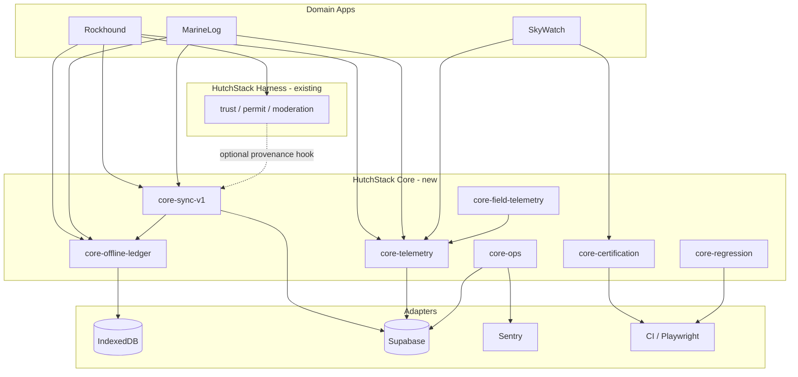

# HutchStack Core — Platform Extraction & Migration Plan

**Authors:** Principal Systems Engineer, SRE, HutchStack Platform Architect  
**Date:** 2026-06-07  
**Status:** Phase 1 complete — contract extraction via `@rockhounding/shared` shims  
**Report:** [`packages/hutchstack-core/docs/PHASE_1_REPORT.md`](../../packages/hutchstack-core/docs/PHASE_1_REPORT.md)  
**Baseline:** Rockhound operational maturity (Sprint 3 sync cert `7d9a807`, public beta ops plan)

---

## Executive summary

Rockhound has matured **field-offline**, **idempotent sync**, **telemetry**, and **release/ops** patterns that are domain-agnostic enough to become **HutchStack Core** — reusable platform modules beneath the existing **HutchStack Field Discovery Harness** (trust, permit, moderation scoring).

This plan:

1. Evaluates ten extraction candidates.
2. Proposes a **`@hutchstack/core-*` package family** (or `packages/hutchstack-core/` monorepo layout).
3. Defines migration phases that **wrap, don't rewrite** Rockhound — adapters keep current URLs, IndexedDB schema, and `POST /api/v1/sync/batch` behavior frozen until V1.1 gate.

**HutchStack layering (target):**

```
┌─────────────────────────────────────────────────────────────┐
│  Domain apps (Rockhound, MarineLog, SkyWatch, FieldLab…)    │
├─────────────────────────────────────────────────────────────┤
│  HutchStack Harness (trust, permit, moderation — EXISTING)   │
├─────────────────────────────────────────────────────────────┤
│  HutchStack Core (NEW — this plan)                          │
│  offline-ledger │ sync-v1 │ telemetry │ ops │ cert │ field  │
├─────────────────────────────────────────────────────────────┤
│  Adapters: Supabase, Sentry, Vercel, IndexedDB, Playwright  │
└─────────────────────────────────────────────────────────────┘
```

---

## Extraction candidates

### 1. Offline operation queue

|                             |                                                                                                                                                                                              |
| --------------------------- | -------------------------------------------------------------------------------------------------------------------------------------------------------------------------------------------- |
| **Purpose**                 | Durable client-side ledger for field captures when connectivity is poor; supports priority, dependency ordering, TTL, and queue status transitions (`PENDING` → `IN_FLIGHT` → terminal).     |
| **Current location**        | `apps/web/lib/storage/manager.ts` (IndexedDB `operations` store), `apps/web/components/Offline/QueueManager.tsx`, `@rockhounding/shared` storage/sync-engine schemas                         |
| **Dependencies**            | IndexedDB (`idb`), `BaseSyncOperationSchema`, StorageAdapter abstraction, browser `online`/`offline` events                                                                                  |
| **Standalone Core module?** | **Yes** — `@hutchstack/core-offline-ledger`                                                                                                                                                  |
| **Public interface**        | `OfflineLedger`: `enqueue(op)`, `getReadyOperations()`, `updateStatus(id, status)`, `getQueueDepth()`, `onQueueChange(cb)`. Types: `LedgerOperation`, `QueueStatus`, `LedgerConfig`.         |
| **Extension points**        | `StorageBackend` (IndexedDB default, SQLite/RN future), `OperationValidator`, `EvictionPolicy`, `EntityTypeRegistry` (domain maps `find` → table handler).                                   |
| **Cross-project reuse**     | **Marine:** dive logs offline at sea. **Astronomy:** observation notes at remote sites. **Field science:** specimen metadata queue. **Any observational platform** with intermittent uplink. |
| **Rockhound preservation**  | Phase 1: extract interfaces + types to Core; Rockhound `StorageManager` implements `OfflineLedger` via thin re-export. No schema migration.                                                  |

---

### 2. Idempotent synchronization engine

|                             |                                                                                                                                                                                                                                                 |
| --------------------------- | ----------------------------------------------------------------------------------------------------------------------------------------------------------------------------------------------------------------------------------------------- |
| **Purpose**                 | Client orchestrator + server batch handler pattern: map ledger → batch request → per-op results; idempotency via `client_operation_id`; no silent drops.                                                                                        |
| **Current location**        | Client: `apps/web/lib/sync/orchestrator.ts`, `batch-mapper.ts`, `queue.ts`. Server: `apps/web/app/api/v1/sync/batch/handler.ts`. Contract: `packages/shared/src/v1-contract.ts` (`SyncBatchRequestSchema`, `SyncBatchResponseSchema`)           |
| **Dependencies**            | Offline ledger, HTTP transport, Zod contracts, Supabase `sync_operations` + domain tables (`finds`), auth session                                                                                                                               |
| **Standalone Core module?** | **Yes (split client/server)** — `@hutchstack/core-sync-v1` (contracts + client orchestrator), `@hutchstack/core-sync-v1-server` (batch processor framework)                                                                                     |
| **Public interface**        | **Client:** `SyncOrchestrator.flush()`, `startHeartbeat(ms)`, `handleResults(batchResponse)`. **Server:** `createBatchHandler({ handlers: EntityHandlerMap })`. **Contract:** `SyncBatchRequest`, `SyncBatchResult`, `EntityHandler<TPayload>`. |
| **Extension points**        | `EntityHandler` per `entity_type` + `operation_type`; `Transport` (fetch default); `IdempotencyStore`; `ProvenanceEmitter` (optional hook, Rockhound stub today).                                                                               |
| **Cross-project reuse**     | Same batch/idempotency pattern for any entity: marine **sighting**, astronomy **target log**, sensor **reading upload**. Domain only registers handlers.                                                                                        |
| **Rockhound preservation**  | **Certified path frozen:** Rockhound registers single handler `find/create` pointing to existing handler logic. Wrapper imports from Core; behavior identical via golden tests (`field-validation.meta001a`, `route.test.ts`).                  |

---

### 3. Telemetry event contract

|                             |                                                                                                                                                                                                 |
| --------------------------- | ----------------------------------------------------------------------------------------------------------------------------------------------------------------------------------------------- |
| **Purpose**                 | Versioned, categorized event schema for performance, sync, cache, user_interaction, errors — offline-buffered, batch-ingested.                                                                  |
| **Current location**        | `packages/shared/src/telemetry.ts`, `apps/web/app/api/telemetry/ingest/route.ts`, `apps/web/lib/telemetry/aggregator.ts`, Supabase `telemetry_events`                                           |
| **Dependencies**            | Zod, Supabase (or generic ingest endpoint), session/user context                                                                                                                                |
| **Standalone Core module?** | **Yes** — `@hutchstack/core-telemetry`                                                                                                                                                          |
| **Public interface**        | `TelemetryEvent`, `TelemetryBatch`, `TelemetryCategory`, `EventSeverity`, `TelemetryClient.record(event)`, `TelemetryClient.flush()`. Standard **field ops event catalog** (see ops plan §2.2). |
| **Extension points**        | `EventCatalog` (declare allowed `event_name`s per domain), `IngestTransport`, `PrivacyScrubber` (coord rounding), `SamplingPolicy`.                                                             |
| **Cross-project reuse**     | Unified ops dashboards across HutchStack apps. Marine: **dive depth + sync**. Astronomy: **exposure time + plate solve latency**. Field science: **GPS accuracy + instrument status**.          |
| **Rockhound preservation**  | Move schemas to Core; Rockhound re-exports from `@rockhounding/shared` for backward compat. Ingest route becomes thin wrapper calling `createTelemetryIngestHandler(supabase)`.                 |

---

### 4. Operational dashboards

|                             |                                                                                                                                                                         |
| --------------------------- | ----------------------------------------------------------------------------------------------------------------------------------------------------------------------- |
| **Purpose**                 | Standard panel definitions, SQL templates, and Sentry widget specs for field-platform health (queue depth, sync %, crash-free, Quick Log SLO, compliance interactions). |
| **Current location**        | `docs/operations/production-operations-plan-public-beta.md` (spec only — not yet wired)                                                                                 |
| **Dependencies**            | Supabase SQL, Sentry Release Health, telemetry event catalog, CI status API                                                                                             |
| **Standalone Core module?** | **Partial** — `@hutchstack/core-ops-dashboards` as **config + SQL templates + JSON dashboard exports**, not a hosted UI                                                 |
| **Public interface**        | `DashboardSpec`: panels[], queries[], targets{}. `renderSupabaseQueries()`, `sentryDashboardImport()`, `grafanaExport()` (optional).                                    |
| **Extension points**        | `PanelRegistry` — domains add panels (e.g. Rockhound `prohibited_interaction`; Marine `no-fly-zone`). `MetricTarget` overrides per environment.                         |
| **Cross-project reuse**     | Same six core panels everywhere; swap domain-specific panel D6 equivalent. Single ops training playbook across HutchStack portfolio.                                    |
| **Rockhound preservation**  | Ops plan becomes `rockhound.dashboard.yaml` extending Core base. No runtime change until telemetry events wired.                                                        |

---

### 5. Alerting and escalation framework

|                             |                                                                                                                                                                      |
| --------------------------- | -------------------------------------------------------------------------------------------------------------------------------------------------------------------- |
| **Purpose**                 | Severity taxonomy (P0–P3), alert rules with thresholds, escalation paths, rollback criteria — evidence-based incident response.                                      |
| **Current location**        | `docs/operations/production-operations-plan-public-beta.md` §3                                                                                                       |
| **Dependencies**            | Sentry alerts, Supabase scheduled queries or external monitor, PagerDuty/Slack (adapter), CI webhooks                                                                |
| **Standalone Core module?** | **Yes (policy-as-code)** — `@hutchstack/core-ops-alerts`                                                                                                             |
| **Public interface**        | `AlertRule { id, condition, window, severity, runbook }`, `EscalationPolicy`, `evaluateAlerts(metrics) → Alert[]`. Export formats: Sentry, Datadog, generic webhook. |
| **Extension points**        | `AlertRuleRegistry`, `MetricProvider` (pull from Supabase/Sentry), `DomainRunbook` links.                                                                            |
| **Cross-project reuse**     | P0 definitions identical (data loss, auth bypass, duplicate replay). Domains add P2 rules (e.g. marine **AIS conflict**, astronomy **mount sync failure**).          |
| **Rockhound preservation**  | Rockhound `alerts.yaml` extends Core defaults A-01–A-10. Implement monitors without changing app code.                                                               |

---

### 6. Certification gate framework

|                             |                                                                                                                                                                                                  |
| --------------------------- | ------------------------------------------------------------------------------------------------------------------------------------------------------------------------------------------------ |
| **Purpose**                 | Structured milestone gates (entry/exit criteria), sign-off templates, PASS/FAIL/PENDING verdicts, SHA recording — sprint and release certification.                                              |
| **Current location**        | `docs/implementation/sprint-*-certification-gates.md`, `certification-closed-beta.md`, `certification-sprint-03-field-*.md`                                                                      |
| **Dependencies**            | Git SHA, CI results, manual checklist completion, issue tracker                                                                                                                                  |
| **Standalone Core module?** | **Yes** — `@hutchstack/core-certification`                                                                                                                                                       |
| **Public interface**        | `CertificationGate { id, sections[], blockers[] }`, `GateEvaluator.evaluate(checklist) → Verdict`, `CertificationRecord { sha, date, certifiedBy, verdict }`. Markdown + YAML checklist schemas. |
| **Extension points**        | `SectionTemplate`, `AutomatedGate` (CI test name → pass), `ManualGate`, `KnownRiskRegister`.                                                                                                     |
| **Cross-project reuse**     | Marine **M2 dive cert**, astronomy **M2 observation cert** reuse same gate machinery; only section content differs.                                                                              |
| **Rockhound preservation**  | Existing cert docs become YAML instances of Core templates. META-003 checklist unchanged semantically.                                                                                           |

---

### 7. Regression watchlist framework

|                             |                                                                                                                                                             |
| --------------------------- | ----------------------------------------------------------------------------------------------------------------------------------------------------------- |
| **Purpose**                 | Pre-promote and weekly regression matrix: automated + manual checks, block-promote flags, owner assignment.                                                 |
| **Current location**        | `docs/operations/production-operations-plan-public-beta.md` §5 (R-01–R-12)                                                                                  |
| **Dependencies**            | Playwright/Vitest test IDs, manual field playbook, CI                                                                                                       |
| **Standalone Core module?** | **Yes** — `@hutchstack/core-regression`                                                                                                                     |
| **Public interface**        | `WatchlistItem { id, area, verify, how, owner, blockPromote }`, `WatchlistRunner.run() → Report`, integration with CI via tagged tests (`@watchlist R-07`). |
| **Extension points**        | Domain watchlist YAML merges with Core base (offline persistence, duplicate sync, auth session always present).                                             |
| **Cross-project reuse**     | Core items R-01, R-02, R-09 apply to all field apps. Marine adds **waterproof mode**; astronomy adds **red-light UI**.                                      |
| **Rockhound preservation**  | Rockhound watchlist = Core base + R-03–R-08, R-10–R-12. E2E tags added incrementally; no test logic change.                                                 |

---

### 8. Release readiness scorecards

|                             |                                                                                                                                                                              |
| --------------------------- | ---------------------------------------------------------------------------------------------------------------------------------------------------------------------------- |
| **Purpose**                 | V1.0 / production-ready criteria grouped by reliability, field, ops, certification — percentage complete tracking.                                                           |
| **Current location**        | `docs/operations/production-operations-plan-public-beta.md` §6                                                                                                               |
| **Dependencies**            | Certification gates, metrics dashboards, alert history, cohort data                                                                                                          |
| **Standalone Core module?** | **Yes** — `@hutchstack/core-readiness` (often bundled with certification)                                                                                                    |
| **Public interface**        | `ReadinessScorecard { gates: Gate[] }`, `scorecardCompletion() → { pass, partial, fail, pct }`, `declareProductionReady(scorecard) → Record` (requires 100% critical gates). |
| **Extension points**        | `GateGroup` (reliability, field, ops, cert), domain-specific gate injection, `WaivedGate` with approver audit.                                                               |
| **Cross-project reuse**     | Same V1.0 structure; marine swaps V1-F5 for **50 dive sessions**; astronomy for **50 observation sessions**.                                                                 |
| **Rockhound preservation**  | §6 gates become `rockhound-v1-readiness.yaml`. No code until gate evaluator CLI exists (Phase 3).                                                                            |

---

### 9. Incident response templates

|                             |                                                                                                                   |
| --------------------------- | ----------------------------------------------------------------------------------------------------------------- |
| **Purpose**                 | Standard incident lifecycle: acknowledge → triage → rollback decision → postmortem — aligned to alert severities. |
| **Current location**        | Ops plan §3.3 escalation; implicit in sprint cert blockers                                                        |
| **Dependencies**            | Alert framework, deploy rollback (Vercel), comms channel                                                          |
| **Standalone Core module?** | **Partial** — `@hutchstack/core-ops-incident` (Markdown/JSON templates + CLI scaffolder)                          |
| **Public interface**        | `IncidentTemplate { severity, responseTime, sections[] }`, `createIncidentDoc(id)`, `postmortemTemplate`.         |
| **Extension points**        | Domain-specific runbook links (Rockhound sync path, Marine comms loss).                                           |
| **Cross-project reuse**     | Identical P0/P1 response across HutchStack org; reduces on-call training cost.                                    |
| **Rockhound preservation**  | Templates only; no runtime. Link from Rockhound ops plan.                                                         |

---

### 10. Field telemetry aggregation patterns

|                             |                                                                                                                                                       |
| --------------------------- | ----------------------------------------------------------------------------------------------------------------------------------------------------- |
| **Purpose**                 | Client-side batching, offline buffer, periodic flush, session-scoped aggregation (p50/p95), privacy scrubbing before ingest.                          |
| **Current location**        | `apps/web/lib/telemetry/aggregator.ts`, telemetry ingest route, ops plan event catalog                                                                |
| **Dependencies**            | Telemetry contract (#3), network status, auth                                                                                                         |
| **Standalone Core module?** | **Yes** — `@hutchstack/core-field-telemetry` (client aggregator + server rollups)                                                                     |
| **Public interface**        | `FieldTelemetryAggregator`: `track(name, metadata)`, `setSessionContext()`, `flush()`. Server: `rollupSessionMetrics(events) → { p50, p95, counts }`. |
| **Extension points**        | `AggregationWindow`, `MetricExtractor`, `CoordScrubber`, `SessionDefinition`.                                                                         |
| **Cross-project reuse**     | **Field science:** instrument reading latency. **Marine:** sample collection time. **Astronomy:** target acquisition time. Same aggregation math.     |
| **Rockhound preservation**  | Wrap existing aggregator; wire ops plan events (`quick_log_completed`, `sync_queue_depth`) without changing Quick Log UX.                             |

---

## Recommended HutchStack Core package map

| Package                            | Candidates       | Priority                           |
| ---------------------------------- | ---------------- | ---------------------------------- |
| `@hutchstack/core-offline-ledger`  | #1               | P0                                 |
| `@hutchstack/core-sync-v1`         | #2               | P0                                 |
| `@hutchstack/core-telemetry`       | #3, #10          | P0                                 |
| `@hutchstack/core-ops`             | #4, #5, #9       | P1                                 |
| `@hutchstack/core-certification`   | #6, #8           | P1                                 |
| `@hutchstack/core-regression`      | #7               | P1                                 |
| `@hutchstack/core-field-telemetry` | #10 (client agg) | P2 — merge into telemetry if small |

**Not promoted to Core (stay Rockhound / Harness domain):**

- HutchStack Harness components (permit, trust, moderation) — already in `@rockhounding/shared/hutchstack`
- Rockhound V1 domain contracts (`LocationV1`, `FindV1`, access check RPC)
- Map/Quick Log UI, trust badges, seed locations

---

## Migration plan (maximize reuse, preserve behavior)

### Phase 0 — Boundary definition (Week 1, no runtime change)

**Goal:** Draw package boundaries; freeze Rockhound cert tests as golden master.

| Action                                                | Output                                                                      |
| ----------------------------------------------------- | --------------------------------------------------------------------------- |
| Create `packages/hutchstack-core/` workspace scaffold | Empty packages with `package.json` exports                                  |
| Document adapter matrix                               | `docs/hutchstack/CORE_ADAPTER_MATRIX.md`                                    |
| Tag golden tests                                      | `field-validation.meta001a`, `route.test.ts`, E2E 6/6 must pass on every PR |
| Add `HUTCHSTACK_CORE_BOUNDARY.test.ts`                | Assert Rockhound does not import domain into Core                           |

**Exit:** CI green; no behavior change.

---

### Phase 1 — Contracts extraction (Weeks 2–3)

**Goal:** Move **types and Zod schemas only**; Rockhound re-exports.

| Extract             | From                            | To                                             |
| ------------------- | ------------------------------- | ---------------------------------------------- |
| Sync batch contract | `v1-contract.ts`                | `@hutchstack/core-sync-v1/contract`            |
| Telemetry schemas   | `telemetry.ts`                  | `@hutchstack/core-telemetry`                   |
| Sync engine enums   | `sync-engine.ts` (queue status) | `@hutchstack/core-offline-ledger/types`        |
| Ops event catalog   | ops plan §2.2                   | `@hutchstack/core-telemetry/catalog/field-ops` |

**Rockhound change:** `packages/shared` re-exports from `@hutchstack/core-*` (shim layer).

**Exit:** 30/30 unit tests pass; type-check clean; zero diff in generated API responses.

---

### Phase 2 — Client runtime extraction (Weeks 4–6)

**Goal:** Extract orchestrator + ledger **interfaces**; Rockhound implements via move-refactor.

| Step | Detail                                                                               |
| ---- | ------------------------------------------------------------------------------------ |
| 2a   | Implement `OfflineLedger` interface; `StorageManager` satisfies it                   |
| 2b   | Move `SyncOrchestrator` to Core; inject `transport`, `ledger`, `mapToBatch`          |
| 2c   | Move `batch-mapper`, `quick-log-gating` policy to Core as **optional gating plugin** |
| 2d   | Move `FieldTelemetryAggregator` to Core                                              |

**Rockhound adapter:**

```typescript
// apps/web/lib/sync/rockhound-sync.ts (thin)
import { SyncOrchestrator } from '@hutchstack/core-sync-v1';
import { getStorageManager } from '@/lib/storage/manager';

export const syncManager = SyncOrchestrator.create({
  ledger: getStorageManager(),
  batchUrl: '/api/v1/sync/batch',
  mapToBatch: mapLedgerToV1Batch, // Rockhound-specific until handler registry
});
```

**Exit:** META-001A 10/10; E2E 6/6; manual field smoke unchanged.

---

### Phase 3 — Server runtime extraction (Weeks 7–8)

**Goal:** Generalize batch handler; Rockhound registers find handler only.

| Step | Detail                                                                        |
| ---- | ----------------------------------------------------------------------------- |
| 3a   | `createBatchHandler({ handlers, idempotencyStore, provenanceHook? })` in Core |
| 3b   | Rockhound `handler.ts` becomes `findCreateHandler` registered with Core       |
| 3c   | Telemetry ingest → `createTelemetryIngestHandler`                             |

**Certification gate:** No change to `POST /api/v1/sync/batch` request/response shape without V1.1 gate.

**Exit:** `route.test.ts` passes unchanged; idempotency SQL audit clean.

---

### Phase 4 — Ops & certification as code (Weeks 9–10)

**Goal:** Promote docs to Core YAML; CLI for gate/watchlist evaluation.

| Deliverable                         | Source                     |
| ----------------------------------- | -------------------------- |
| `core/alerts/default.yaml`          | Ops plan A-01–A-08         |
| `core/regression/base.yaml`         | R-01, R-02, R-09, R-11     |
| `rockhound/regression.yaml`         | R-03–R-08, R-10, R-12      |
| `core/certification/gate-schema.ts` | Sprint gate docs           |
| `rockhound/meta-003.yaml`           | closed-beta cert           |
| `core/readiness/v1-template.yaml`   | Ops plan §6                |
| `hutchstack-cli certify evaluate`   | Gate evaluator (read-only) |

**Exit:** `hutchstack-cli certify evaluate rockhound/meta-003.yaml` produces same verdict as manual review.

---

### Phase 5 — Cross-project validation (Weeks 11–12)

**Goal:** Prove reuse without forking.

| Spike project                    | Core modules used                    | Validates              |
| -------------------------------- | ------------------------------------ | ---------------------- |
| **FieldLab-minimal** (synthetic) | offline-ledger + sync-v1 + telemetry | Handler registry       |
| **Marine stub**                  | + ops alerts + regression base       | Domain panel extension |
| **Docs-only astronomy**          | certification + readiness templates  | Gate YAML              |

**Exit:** One non-Rockhound repo imports `@hutchstack/core-sync-v1` and passes sample cert gate.

---

## Dependency graph (Core modules)



---

## Risk controls

| Risk                         | Mitigation                                                                |
| ---------------------------- | ------------------------------------------------------------------------- |
| Breaking certified sync path | Golden tests + SHA-frozen handler; Phase 3 gated on META-001A             |
| Over-abstraction             | Extract interfaces first; single Rockhound adapter until Phase 5 spike    |
| Harness / Core confusion     | Harness = **domain quality scoring**; Core = **platform plumbing**        |
| Premature multi-repo         | Monorepo `packages/hutchstack-core/*` until second consumer ships         |
| Ops YAML drift               | Core owns base; Rockhound extends via `extends: core/alerts/default.yaml` |

---

## Success criteria for extraction complete

| Criterion                                          | Evidence                                     |
| -------------------------------------------------- | -------------------------------------------- |
| Rockhound zero behavior regression                 | 30 unit + 6 E2E + field-validation META-001A |
| `@hutchstack/core-sync-v1` imported by ≥2 projects | FieldLab-minimal + Rockhound                 |
| Ops alerts exportable from YAML                    | Sentry import JSON generated                 |
| Certification evaluator matches manual META-003    | CLI parity check                             |
| HutchStack Harness unchanged in responsibility     | Governance charter still accurate            |
| Public beta ops dashboards use Core event catalog  | D1–D6 panels populated                       |

---

## Immediate next steps (no feature work)

1. **Approve** package naming and Phase 0 scaffold PR.
2. **Assign** Core maintainers (Platform Steward + SRE).
3. **Run** Phase 0 golden test baseline on `feat/sprint-4-field-mode` or cert SHA.
4. **Defer** second consumer repo until Phase 1 contracts land.

---

**Document owner:** HutchStack Platform Architecture  
**Review cadence:** End of each migration phase  
**Related:** [`HUTCHSTACK_GOVERNANCE_CHARTER.md`](./HUTCHSTACK_GOVERNANCE_CHARTER.md), [`../operations/production-operations-plan-public-beta.md`](../operations/production-operations-plan-public-beta.md)
