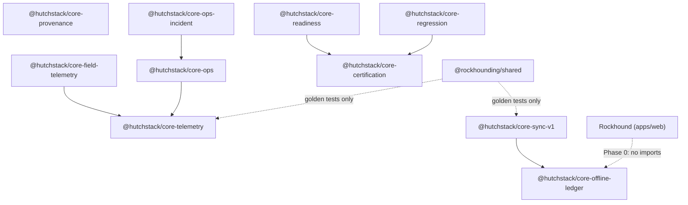

# HutchStack Core — Dependency Graph

## Inter-package dependencies (Phase 0)



## Dependency matrix

| Package                | Depends on (Core) | Depends on (external) |
| ---------------------- | ----------------- | --------------------- |
| `core-offline-ledger`  | —                 | —                     |
| `core-sync-v1`         | offline-ledger    | —                     |
| `core-telemetry`       | —                 | —                     |
| `core-field-telemetry` | telemetry         | —                     |
| `core-provenance`      | —                 | —                     |
| `core-ops`             | telemetry         | —                     |
| `core-ops-incident`    | ops               | —                     |
| `core-certification`   | —                 | —                     |
| `core-regression`      | certification     | —                     |
| `core-readiness`       | certification     | —                     |

## Rockhound relationship (Phase 0)

| Rockhound component              | Future Core adapter (Phase 2+) | Phase 0 status |
| -------------------------------- | ------------------------------ | -------------- |
| `StorageManager`                 | `OfflineLedger`                | Unchanged      |
| `SyncManager` (orchestrator)     | `SyncOrchestrator`             | Unchanged      |
| `POST /api/v1/sync/batch`        | `EntityHandler` registry       | Unchanged      |
| `@rockhounding/shared` telemetry | `core-telemetry` re-export     | Unchanged      |
| Ops plan docs                    | `core-ops` YAML                | Unchanged      |

## Layering rule

```
Domain app → HutchStack Harness (quality) → HutchStack Core (platform) → Adapters
```

Core packages must **not** import Rockhound domain types (`FindV1`, `LocationV1`, etc.).
